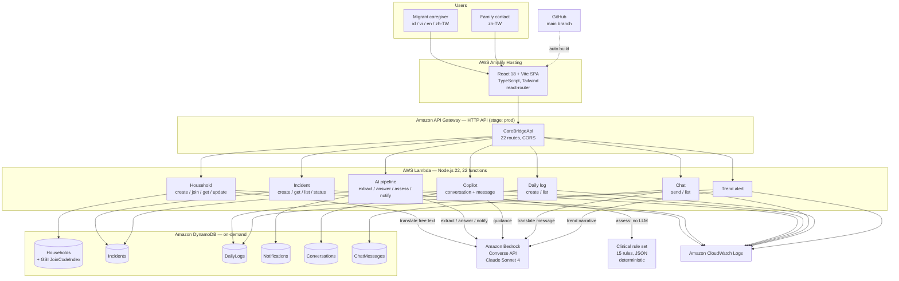
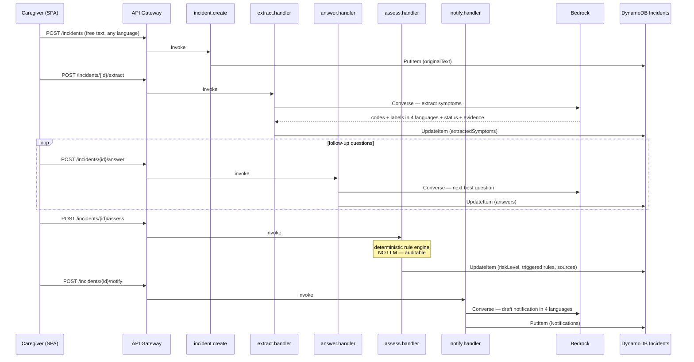

# CareBridge AI — System Architecture

AI cross-language care coordination platform. A migrant caregiver records observations in
their own language; a family contact reads everything in theirs. Symptom extraction,
deterministic clinical triage, and notification drafting run on Amazon Bedrock.

Deployed: AWS `us-west-2`, CloudFormation stack `carebridge-ai` (AWS SAM).

---

## 1. Deployment topology

```
[Caregiver browser]  [Family contact browser]
        |                     |
        +----------+----------+
                   |  HTTPS
                   v
        AWS Amplify Hosting
        (React SPA, CloudFront CDN)
        source: GitHub main branch, auto-build
                   |
                   |  HTTPS / JSON  (fetch)
                   v
        Amazon API Gateway  (HTTP API v2)
        stage: prod  |  CORS enabled  |  22 routes
                   |
                   v
        AWS Lambda  x22  (Node.js 22, x86_64, 256 MB)
        bundled with esbuild -> CJS, one file per handler
             |                          |
             |                          |
             v                          v
    Amazon DynamoDB x6          Amazon Bedrock
    (on-demand billing)         Converse API
                                Claude Sonnet 4
                                (cross-region inference profile)
                                Guardrails: parameterised, not enabled
             |
             v
      Amazon CloudWatch Logs (all Lambdas)
```

### Node list (for diagram tools)

| ID | Type | Label | Notes |
|----|------|-------|-------|
| user_caregiver | Actor | Migrant caregiver | Indonesian / Vietnamese / English / Chinese |
| user_contact | Actor | Family contact | Employer, usually Chinese |
| amplify | AWS Amplify Hosting | CareBridge Web (React SPA) | CloudFront + S3 behind the scenes |
| github | External | GitHub repository | Push to `main` triggers Amplify build |
| apigw | Amazon API Gateway | HTTP API `CareBridgeApi` | stage `prod`, 22 routes |
| lambda_household | AWS Lambda | Household functions (4) | create / join / get / update |
| lambda_incident | AWS Lambda | Incident functions (4) | create / get / list / updateStatus |
| lambda_ai | AWS Lambda | AI pipeline functions (4) | extract / answer / assess / notify |
| lambda_copilot | AWS Lambda | Copilot functions (4) | conversation CRUD + message |
| lambda_chat | AWS Lambda | Chat functions (2) | send (translating) / list |
| lambda_dailylog | AWS Lambda | Daily log functions (2) | create / list |
| lambda_trend | AWS Lambda | Trend alert function (1) | narrative trend summary |
| lambda_health | AWS Lambda | Health check (1) | |
| ddb_households | Amazon DynamoDB | CareBridge-Households | + GSI JoinCodeIndex |
| ddb_incidents | Amazon DynamoDB | CareBridge-Incidents | |
| ddb_dailylogs | Amazon DynamoDB | CareBridge-DailyLogs | |
| ddb_notifications | Amazon DynamoDB | CareBridge-Notifications | |
| ddb_conversations | Amazon DynamoDB | CareBridge-Conversations | |
| ddb_chatmessages | Amazon DynamoDB | CareBridge-ChatMessages | |
| bedrock | Amazon Bedrock | Converse API — Claude Sonnet 4 | `us.anthropic.claude-sonnet-4-20250514-v1:0` |
| rules | Config artifact | Clinical rule set (JSON, 15 rules) | bundled into the assess Lambda |
| cwlogs | Amazon CloudWatch Logs | Lambda logs | |

### Edge list (for diagram tools)

```
github            -> amplify            : push to main triggers build
user_caregiver    -> amplify            : HTTPS
user_contact      -> amplify            : HTTPS
amplify           -> apigw              : HTTPS / JSON (fetch)

apigw -> lambda_household  : /households*
apigw -> lambda_incident   : /incidents*
apigw -> lambda_ai         : /incidents/{id}/extract|answer|assess|notify
apigw -> lambda_copilot    : /copilot/*
apigw -> lambda_chat       : /households/{id}/chat
apigw -> lambda_dailylog   : /daily-logs, /households/{id}/daily-logs
apigw -> lambda_trend      : /trends/{id}/alert
apigw -> lambda_health     : /health

lambda_household  -> ddb_households     : GetItem / PutItem / UpdateItem / Query(GSI)
lambda_household  -> bedrock            : translate free text to 4 languages
lambda_incident   -> ddb_incidents      : CRUD
lambda_ai         -> ddb_incidents      : read/write extraction + assessment
lambda_ai         -> ddb_notifications  : write notification (notify only)
lambda_ai         -> bedrock            : extract / answer / notify (assess does NOT)
lambda_ai         -> rules              : deterministic rule evaluation (assess only)
lambda_copilot    -> ddb_conversations  : CRUD
lambda_copilot    -> bedrock            : conversational guidance (+Guardrail hook)
lambda_chat       -> ddb_chatmessages   : write/read
lambda_chat       -> bedrock            : per-message translation
lambda_dailylog   -> ddb_dailylogs      : write/read
lambda_trend      -> ddb_dailylogs      : Query last N days
lambda_trend      -> bedrock            : narrative trend summary

lambda_household  -> cwlogs
lambda_incident   -> cwlogs
lambda_ai         -> cwlogs
lambda_copilot    -> cwlogs
lambda_chat       -> cwlogs
lambda_dailylog   -> cwlogs
lambda_trend      -> cwlogs
```

### Mermaid — architecture



---

## 2. API surface — route to Lambda to data

| Method | Path | Lambda handler | DynamoDB | Bedrock |
|--------|------|----------------|----------|---------|
| GET | `/health` | `health.handler` | — | — |
| POST | `/households` | `household.create` | Households | yes |
| POST | `/households/join` | `household.join` | Households (GSI JoinCodeIndex) | — |
| GET | `/households/{householdId}` | `household.get` | Households | — |
| PATCH | `/households/{householdId}` | `household.update` | Households | yes |
| POST | `/incidents` | `incident.create` | Incidents | — |
| GET | `/incidents/{incidentId}` | `incident.get` | Incidents | — |
| GET | `/households/{householdId}/incidents` | `incident.list` | Incidents | — |
| PATCH | `/incidents/{incidentId}/status` | `incident.updateStatus` | Incidents | — |
| POST | `/incidents/{incidentId}/extract` | `extract.handler` | Incidents | yes |
| POST | `/incidents/{incidentId}/answer` | `answer.handler` | Incidents | yes |
| POST | `/incidents/{incidentId}/assess` | `assess.handler` | Incidents | no (rules only) |
| POST | `/incidents/{incidentId}/notify` | `notify.handler` | Incidents, Notifications | yes |
| POST | `/copilot/conversations` | `copilot.createConversation` | Conversations | — |
| POST | `/copilot/conversations/{conversationId}/messages` | `copilot.sendMessage` | Conversations | yes |
| GET | `/copilot/conversations/{conversationId}` | `copilot.getConversation` | Conversations | — |
| GET | `/households/{householdId}/conversations` | `copilot.listConversations` | Conversations | — |
| POST | `/daily-logs` | `dailyLog.create` | DailyLogs | — |
| GET | `/households/{householdId}/daily-logs` | `dailyLog.list` | DailyLogs | — |
| POST | `/households/{householdId}/chat` | `chat.send` | ChatMessages | yes |
| GET | `/households/{householdId}/chat` | `chat.list` | ChatMessages | — |
| POST | `/trends/{householdId}/alert` | `trend.handler` | DailyLogs | yes |

Lambdas that call Bedrock run with `Timeout: 60`; the rest inherit the global `Timeout: 30`.

---

## 3. Data model

Single-region DynamoDB, on-demand capacity. `householdId` is the partition key everywhere,
so all of a family's data colocates.

| Table | PK | SK | Index | Holds |
|-------|----|----|-------|-------|
| `CareBridge-Households` | `householdId` | — | GSI `JoinCodeIndex` (`joinCode`) | elder profile, caregiver profile, contact profile, care guidelines + translations |
| `CareBridge-Incidents` | `householdId` | `incidentId` | — | original text, extracted symptoms, follow-up answers, assessment result |
| `CareBridge-DailyLogs` | `householdId` | `logId` | — | meals, sleep, weight, temperature, mobility, breathing, mood, excretion, notes |
| `CareBridge-Notifications` | `householdId` | `notificationId` | — | drafted notification titles/summaries per language, recipients, channel |
| `CareBridge-Conversations` | `householdId` | `conversationId` | — | copilot message history |
| `CareBridge-ChatMessages` | `householdId` | `messageId` | — | caregiver/contact messages, original + translations |

IDs are ULIDs (lexicographically sortable, so sort key order equals chronological order).
`joinCode` is a 6-character human-readable code, the only way to attach a device to a household.

---

## 4. Core flows

### 4.1 Incident triage (caregiver reports something abnormal)



The split matters: **symptom understanding is AI, risk decision is not**. The assess step
evaluates a versioned JSON rule set with citations, so every risk level can be traced to a
named guideline rather than to model output.

### 4.2 Clinical rule engine

- 15 active rules: `RF-001` … `RF-010` (red flags), `CH-001` … `CH-005` (chronic disease).
- Each rule: `ruleId`, `title`, `conditions[]`, `riskLevel`, `actionCode`, `sourceTitle`, `sourceUrl`, `publishedAt`, `reviewedAt`, `status`.
- Risk levels, in precedence order: `emergency` > `urgent` > `attention` > `monitor`.
- Action codes: `CALL_EMERGENCY`, `SEEK_MEDICAL_EVALUATION`, `SCHEDULE_EVALUATION`.
- Unknown-symptom policy per condition: `conservative` (treat unknown as a match, fail safe)
  or `skip` (do not match). This is how the system avoids silently downgrading risk when the
  caregiver could not answer.
- Source of truth: `packages/clinical-rules/src/clinical-rules.json`; a copy is bundled into
  the assess Lambda at `services/api/src/rules/clinical-rules.json`.

### 4.3 Cross-language chat

```mermaid
sequenceDiagram
  participant A as Sender (any language)
  participant GW as API Gateway
  participant CH as chat.send
  participant BR as Bedrock
  participant DB as DynamoDB ChatMessages
  participant B as Recipient (other language)

  A->>GW: POST /households/{id}/chat (originalText, originalLanguage)
  GW->>CH: invoke
  CH->>BR: Converse — translate to the other languages
  BR-->>CH: translations map
  CH->>DB: PutItem (originalText + translations)
  B->>GW: GET /households/{id}/chat
  GW-->>B: messages; UI renders the reader's language,<br/>original text available on tap
```

### 4.4 Health trend

Daily logs accumulate; the trend page needs at least 3 days of data. `trend.handler` queries
DailyLogs, computes the series client-side for charting, and asks Bedrock for a short
narrative in the reader's language. Below the threshold it returns
`hasEnoughData: false` and the UI shows a localized "not enough data yet" message instead of
inventing a trend.

---

## 5. Internationalisation strategy

Four languages: `zh-TW`, `en`, `id`, `vi`. Three different mechanisms, chosen per data type.

| Data type | Mechanism | Where it lives | Examples |
|-----------|-----------|----------------|----------|
| UI chrome | Static dictionaries, 294 keys per language | `packages/i18n/src/locales/*.ts` | buttons, labels, errors |
| Bounded-choice user input | Stored as a stable code, rendered through an i18n key | `apps/web/src/constants/careOptions.ts` | gender, relationship, mood, excretion, mobility, breathing, chronic conditions, Taiwan's 22 cities/counties |
| Free-text user input | Translated to all 4 languages **on write** by Bedrock, stored alongside the original | `services/api/src/utils/translate.ts` | care guidelines, other conditions, chat messages, AI summaries |
| Dates / times | `Intl` formatting driven by the app language, not the browser locale | `apps/web/src/hooks/useI18n.tsx` | log timestamps |
| Deliberately untranslated | — | — | the elder's name, phone numbers |

Translate-on-write rather than translate-on-read: reading a record must never wait on a model
call. `translateToAllLanguages()` never throws; if Bedrock is unreachable it stores the source
text under every language so the write still succeeds, and a later save backfills the real
translations.

Legacy records created before code-ification hold free text (e.g. `"男"` instead of `"male"`).
Display helpers fall back to the raw stored value when no i18n key matches, so old and new
records render side by side without a migration.

---

## 6. Repository layout

npm workspaces monorepo, single TypeScript project graph.

```
aws_carebridge/
├── apps/web/                        React 18 + Vite 5 + Tailwind SPA
│   └── src/
│       ├── pages/                   18 route-level screens
│       ├── components/              AppShell, BottomNav, ElderDetail,
│       │                            TimelineDetail, TrendBarChart,
│       │                            UserProfileCard, BackButton
│       ├── hooks/                   useI18n (language + formatting),
│       │                            useAppState (role, household, elder)
│       ├── constants/               careOptions (coded choices),
│       │                            clinicalRuleMeta (emergency rule IDs)
│       └── services/api.ts          single typed API client
│
├── services/api/                    Lambda handlers
│   ├── src/handlers/                health, household, incident, extract,
│   │                                answer, assess, notify, copilot,
│   │                                dailyLog, chat, trend
│   ├── src/utils/                   bedrock (Converse + JSON retry), db,
│   │                                translate, config, id (ULID), response
│   ├── src/rules/                   clinical-rules.json (bundled copy)
│   └── build.mjs                    esbuild -> dist/handlers/*.js (CJS)
│
├── packages/
│   ├── shared-types/                domain types shared by web + api
│   ├── i18n/                        4 locale dictionaries
│   └── clinical-rules/              rule set source of truth
│
├── infrastructure/
│   ├── template.yaml                AWS SAM — 22 functions, 6 tables, HTTP API
│   └── samconfig.toml               stack name, region, parameters (gitignored)
│
├── amplify.yml                      Amplify monorepo build spec
└── docs/                            deployment runbook, workstreams, this file
```

### Frontend screens

Onboarding: `LanguageSelect` → `RoleSelect` → (`ContactProfile` → `ContactChoice` →
`ElderSetup`) or (`CaregiverProfile` → `JoinHousehold`).

Main app with shell: `ContactHome` / `CaregiverHome`, `Chat`, `Copilot`, `Timeline`, `Trends`.

Full-screen flows: `NewIncident`, `DailyLog`, `Assessment`, `Notify`, `MonthlyReport`.

---

## 7. Build and deploy

| Target | Command | Trigger |
|--------|---------|---------|
| Frontend | `npm run build --workspace=apps/web` (`tsc -b && vite build`) | push to GitHub `main`, Amplify builds per `amplify.yml` |
| Lambda bundles | `npm run build:api` (esbuild -> `services/api/dist/handlers/`) | manual |
| Infrastructure | `sam build && sam deploy` from `infrastructure/` | manual |

`sam build` only copies `services/api/dist/`; it does not compile TypeScript. `npm run build:api`
must run first or stale bundles get deployed.

AWS SDK v3 clients (`client-dynamodb`, `lib-dynamodb`, `client-bedrock-runtime`) are marked
external in esbuild and resolved from the Lambda runtime.

### Stack parameters

`EnvironmentName`, `BedrockModelId`, `BedrockGuardrailId`, `BedrockGuardrailVersion`,
`AllowedOrigins`, `LogLevel`.

---

## 8. Known gaps

Worth stating explicitly rather than implying the diagram is the finished product.

- **No authentication.** The HTTP API has no authorizer. The 6-character household join code
  is the only access control, and any client that knows a `householdId` can read and write
  that household. Acceptable for a demo; a real deployment needs Amazon Cognito plus
  per-household authorization.
- **CORS is `*`.** Should be pinned to the Amplify domain.
- **Bedrock Guardrails wired but not enabled.** The template accepts a guardrail ID and
  `copilot.sendMessage` passes it through when present, but the deployed stack has an empty
  value, so no guardrail is currently applied.
- **No multi-tenant account layer.** One household maps to one elder, one caregiver and one
  contact. Many-to-many (a contact with several elders, an elder with several contacts) would
  need a users table and a household-membership join.
- **Notification delivery is drafted, not sent.** The notify flow produces localized text and
  stores it; actual dispatch (SMS/voice) is out of scope.
- **Single region, no DR.** DynamoDB tables are not global; there is no backup schedule.
